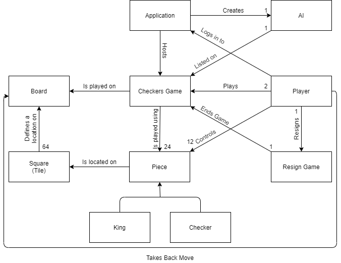
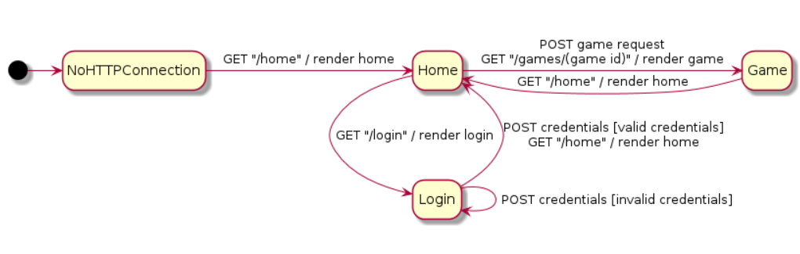
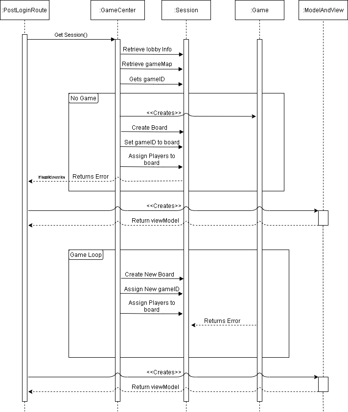

# PROJECT Design Documentation

## Team Information
* Team name: TEAMNAME
* Team members
  * Bin Qiu
  * Truong Anh Tuan Hoang
  * Alex Johannesson
  * Michael Merlino

## Executive Summary

Webcheckers application allows players to play checkers via the Java Spark 
framework. A player must sign in to the application to play with another player.
Once a game is started, the application supports a drag and drop game experience
for making moves.

### Purpose
Users are allowed to play American checkers with other users that are signed in.

### Glossary and Acronyms

| Term | Definition |
|------|------------|
| VO | Value Object |

## Requirements
Players must be able to sign in to the application in order to start a game of
checkers against other signed in players. Using drag and drop interface, players are
able to move their pieces to capture opponent pieces to win. If a player's piece
reaches the opponent's end of the board, that piece will become a king piece. The
king piece is able to move to either side of the board. Players also have the option
to resign when they do not want to continue the game.

### Definition of MVP
Users are able to sign in, start a game by challenging an opponent, and play the game
using American Checker rules.

### MVP Features
* Sign In and Out
  * As a Player, I want to sign in so that I can play a game of checkers.
  * As a Player, I want to sign out so that I can leave the Webcheckers
  application.
* Start Game
  * As a Player, I want to start a game so that I can play checkers with
  opponent.
* Simple Move
  * As a Player, I want to perform a simple move so that I can advance my
  pieces in a game of checkers.
* Single Jump Move
  * As a Player, I want to make a single jump move so that I can capture my
  opponent's piece.
* Multiple Jump Move
  * As a Player, I want to make a multiple jump move so that I can capture
  several of my opponent's pieces in one turn.
* Kings
  * As a Player, I want to get king pieces so tha tI have better pieces to
  use against my opponent.
* Resign
  * As a Player, I want to resign from a game so that I can stop playing checkers.
* Undo
  * As a Player, I want to undo my previous move so that I can make a different move.

### Roadmap of Enhancements

No enhancement is required for this group due to the small size of the group.
AI enhancement is implemented using minimax algorithm. The purpose of the minimax
algorithm is to make the AI difficult to defeat.

## Application Domain

This section describes the application domain.

  
The Application hosts the Checkers Game which users may log into to play or
watch others play as a Spectator. They are also given the option to watch
Replays of their previously played games. Every game is played by 2 Players
who take turns controlling 12 pieces each on a 8x8 Board. Pieces start as
normal pieces and may become King pieces during the process of the game.

## Architecture and Design

This section describes the application architecture.

### Summary

The following Tiers/Layers model shows a high-level view of the webapp's architecture.

As a web application, the user interacts with the system using a
browser.  The client-side of the UI is composed of HTML pages with
some minimal CSS for styling the page.  There is also some JavaScript
that has been provided to the team by the architect.

The server-side tiers include the UI Tier that is composed of UI Controllers and Views.
Controllers are built using the Spark framework and View are built using the FreeMarker framework.  The Application and Model tiers are built using plain-old Java objects (POJOs).

Details of the components within these tiers are supplied below.

### Overview of User Interface

This section describes the web interface flow; this is how the user views and interacts
with the WebCheckers application.

  
The interface is made up of 3 main pages: Home, Game, Login. The user will
get to the Home page and Login. Logging in will render the new Home page
where players are able to challenge other logged in players. Playing a game
will render the Game page and after the game is complete, the players return
to the Home page with the lobby.

### UI Tier

The server-side UI tier is responsible for mapping the HTTP and Routes to the
Controller that is responsible for handling the interaction. This is accomplished
by WebServer.

###Controllers for ViewModel and Redirecting

| Controller | FreeMarker | Function |
| --- | --- | --- |
| GetSignInRoute | signin.ftl | Displays sign-in page |
| GetHomeRoute | home.ftl | Displays home page and player lobby |
| GetGameRoute | game.ftl | Displays game page and sets up the game |
| PostSignInRoute | redirects page | Redirects to home page when sign-in is a success |
| PostSignOutRoute | redirects page | Redirects to sign out page |

###Controllers for AJAX and JSON POJO

| Controller | Request | Response |
| --- | --- | --- |
| PostBackupMoveRoute | NA | Backup message |
| PostCheckTurnRoute | NA | Check turn message |
| PostSubmitTurnRoute | NA | Submit turn message |
| PostResignRoute | NA | Resign message |
| PostValidateMove | Move | Valid move message |

####Sequence Diagram for PostSignInRoute

### Application Tier

The application tier is made up of components that handle the server-wide
interactions between the players, and the application using GRASP.

### Model Tier

The model tier shows the board of the checker game depending on the player.
It encompasses the two players, checker pieces, and spaces which with interact
together to make a move.

### Design Improvements

If the project were to continue, then the team will work to implement enhancements
such as Spectator Mode and Watch Replays. For the current design, we would like to 
tighten the code where we do not repeat calling functions within a function using dot
notation. This lengthens the code and makes it difficult to read for the programmer.
Our code metrics passed the targeted complexity as unit, but some modules did not meet
the target. GetGameRoute and GetHomeRoute have a Cavg of 5 while PostSubmitTurnRoute has
a Cavg of 4. These hot spots are not that significant, and the program runs without defects
so, we decided to not redesign them. However, we have a high WMC of 107 for the Game module.
This was alarming at first, but after some thought we believe this should be the game considering
Game contains the core logic of the program and therefore should be complex. Other hotspots pertain
to the AI in our efforts to make the AI extremely difficult to defeat. AIPlayer and BoardViewTest
have a Cavg of 4 which and GameState have a WMC of 32. These hotspots did not concern us much. Even
though GameState has a large outlier, it makes sense since it is similar to Game - they both carry 
the core logic for their respective purposes in the program.

## Testing

Testing went smoothly for the majority of the program. We found two bugs during testing.
The first bug allowed users to sign in with the name "Jon Snow", but only portray "Jon".
This new "Jon" would be different from "Jon" that signs in before or after them. The second
bug was when a player signs out during a game, the other player will still remain in the game. 
These bugs were simple fixes.

### Acceptance Testing

All user stories pertaining to the MVP have passed their testings to meet the 
acceptance criteria. All user stories pertaining to the AI enhancement has their
testing to the acceptance criteria.

### Unit Testing and Code Coverage

Our unit testing and code coverage strategy was to start with the smallest and 
simplest classes. By doing so, we can get the easiest unit tests out of the way 
first and then group up for the larger and more difficult unit tests. Unit testing 
have been implemented for the majority of the classes. As of now, only half of the 
unit tests have passed. The ones that did not pass were at 0% which came to us as
an anomaly. Upon further inspection, due to the constant updates and altering of the
code, we did not apply the correct unit testing for some classes. If this project is
to continue, we would like update the unit testing for code coverage and put forth more
effort in being aware that each members' updates to the code need to be accounted for in
the unit testing and code coverage.