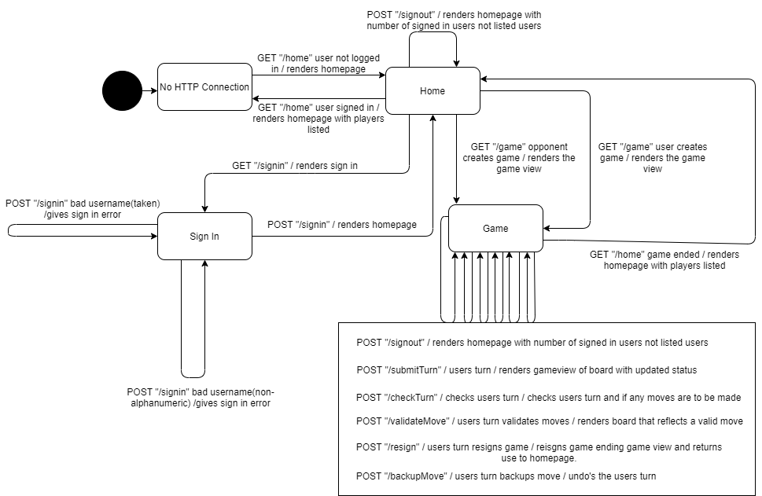

# PROJECT Design Documentation

> _The following template provides the headings for your Design
> Documentation.  As you edit each section make sure you remove these
> commentary 'blockquotes'; the lines that start with a > character
> and appear in the generated PDF in italics._

## Team Information
* Team name: TEAMNAME
* Team members
  * Bin Qiu
  * Truong Anh Tuan Hoang
  * Alex Johannesson
  * Michael Merlino

## Executive Summary

Webcheckers application allows players to play checkers via the Java Spark 
framework. A player must sign in to the application to play with another player.
Once a game is started, the application supports a drag and drop game experience
for making moves.

### Purpose
Users are allowed to play American checkers with other users that are signed in.

### Glossary and Acronyms

| Term | Definition |
|------|------------|
| VO | Value Object |

## Requirements
Players must be able to sign in to the application in order to start a game of
checkers against other signed in players. Using drag and drop interface, players are
able to move their pieces to capture opponent pieces to win. If a player's piece
reaches the opponent's end of the board, that piece will become a king piece. The
king piece is able to move to either side of the board. Players also have the option
to resign when they do not want to continue the game.

### Definition of MVP
Users are able to sign in, start a game by challenging an opponent, and play the game
using American Checker rules.

### MVP Features
* Sign In and Out
  * As a Player, I want to sign in so that I can play a game of checkers.
  * As a Player, I want to sign out so that I can leave the Webcheckers
  application.
* Start Game
  * As a Player, I want to start a game so that I can play checkers with
  opponent.
* Simple Move
  * As a Player, I want to perform a simple move so that I can advance my
  pieces in a game of checkers.
* Single Jump Move
  * As a Player, I want to make a single jump move so that I can capture my
  opponent's piece.
* Multiple Jump Move
  * As a Player, I want to make a multiple jump move so that I can capture
  several of my opponent's pieces in one turn.
* Kings
  * As a Player, I want to get king pieces so tha tI have better pieces to
  use against my opponent.
* Resign
  * As a Player, I want to resign from a game so that I can stop playing checkers.
* Undo
  * As a Player, I want to undo my previous move so that I can make a different move.

### Roadmap of Enhancements
> _Provide a list of top-level features in the order you plan to consider them._

## Application Domain

This section describes the application domain.

  
The Application hosts the Checkers Game which users may log into to play or
watch others play as a Spectator. They are also given the option to watch
Replays of their previously played games. Every game is played by 2 Players
who take turns controlling 12 pieces each on a 8x8 Board. Pieces start as
normal pieces and may become King pieces during the process of the game.

## Architecture and Design

This section describes the application architecture.

### Summary

The following Tiers/Layers model shows a high-level view of the webapp's architecture.

As a web application, the user interacts with the system using a
browser.  The client-side of the UI is composed of HTML pages with
some minimal CSS for styling the page.  There is also some JavaScript
that has been provided to the team by the architect.

The server-side tiers include the UI Tier that is composed of UI Controllers and Views.
Controllers are built using the Spark framework and View are built using the FreeMarker framework.  The Application and Model tiers are built using plain-old Java objects (POJOs).

Details of the components within these tiers are supplied below.

### Overview of User Interface

This section describes the web interface flow; this is how the user views and interacts
with the WebCheckers application.

  
The interface is made up of 3 main pages: Home, Game, Login. The user will
get to the Home page and Login. Logging in will render the new Home page
where players are able to challenge other logged in players. Playing a game
will render the Game page and after the game is complete, the players return
to the Home page with the lobby.

### UI Tier
> _Provide a summary of the Server-side UI tier of your architecture.
> Describe the types of components in the tier and describe their
> responsibilities.  This should be a narrative description, i.e. it has
> a flow or "story line" that the reader can follow._

> _At appropriate places as part of this narrative provide one or more
> static models (UML class structure or object diagrams) with some
> details such as critical attributes and methods._

> _You must also provide any dynamic models, such as statechart and
> sequence diagrams, as is relevant to a particular aspect of the design
> that you are describing.  For example, in WebCheckers you might create
> a sequence diagram of the `POST /validateMove` HTTP request processing
> or you might show a statechart diagram if the Game component uses a
> state machine to manage the game._

> _If a dynamic model, such as a statechart describes a feature that is
> not mostly in this tier and cuts across multiple tiers, you can
> consider placing the narrative description of that feature in a
> separate section for describing significant features. Place this after
> you describe the design of the three tiers._

### Application Tier
> _Provide a summary of the Application tier of your architecture. This
> section will follow the same instructions that are given for the UI
> Tier above._

### Model Tier
> _Provide a summary of the Application tier of your architecture. This
> section will follow the same instructions that are given for the UI
> Tier above._

### Design Improvements
> _Discuss design improvements that you would make if the project were
> to continue. These improvement should be based on your direct
> analysis of where there are problems in the code base which could be
> addressed with design changes, and describe those suggested design
> improvements. After completion of the Code metrics exercise, you
> will also discuss the resutling metric measurements.  Indicate the
> hot spots the metrics identified in your code base, and your
> suggested design improvements to address those hot spots._

## Testing
> _This section will provide information about the testing performed
> and the results of the testing._

### Acceptance Testing
> _Report on the number of user stories that have passed all their
> acceptance criteria tests, the number that have some acceptance
> criteria tests failing, and the number of user stories that
> have not had any testing yet. Highlight the issues found during
> acceptance testing and if there are any concerns._

### Unit Testing and Code Coverage
> _Discuss your unit testing strategy. Report on the code coverage
> achieved from unit testing of the code base. Discuss the team's
> coverage targets, why you selected those values, and how well your
> code coverage met your targets. If there are any anomalies, discuss
> those._
